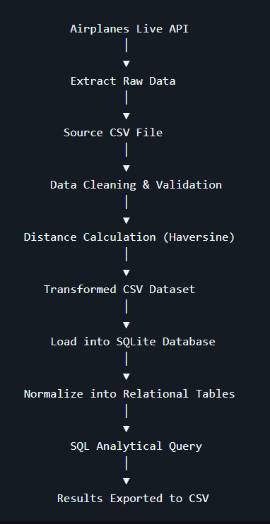
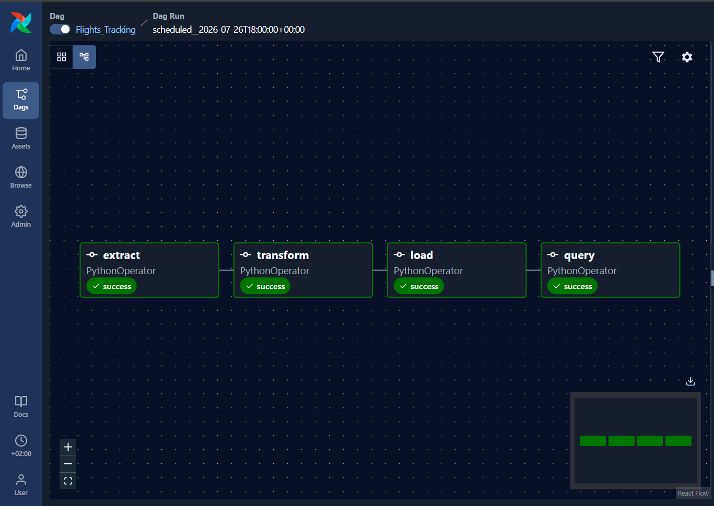
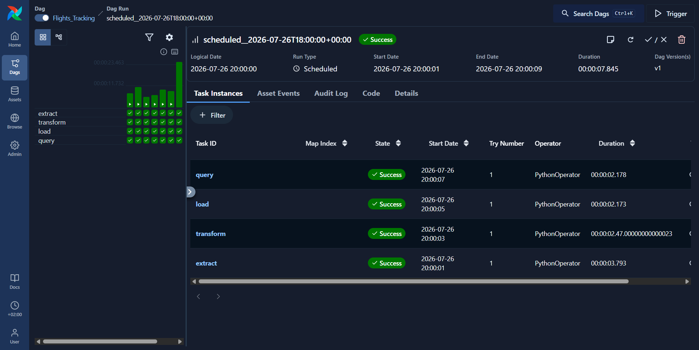
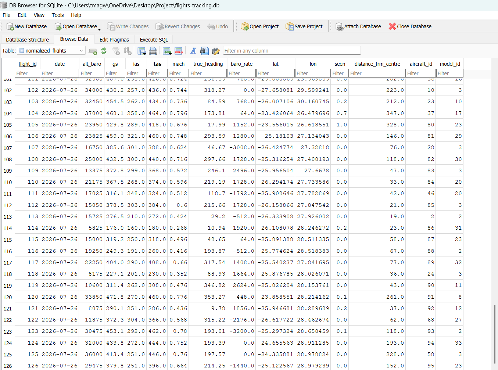
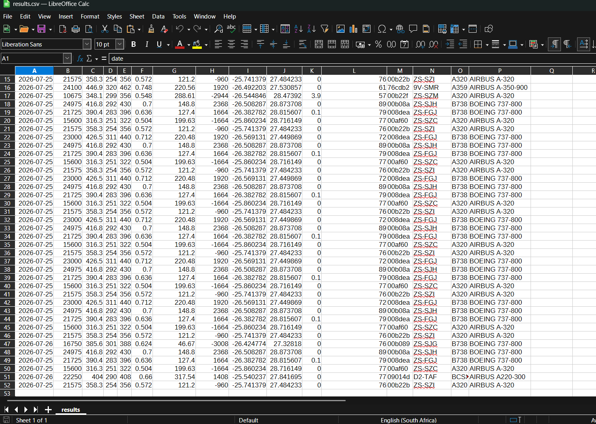
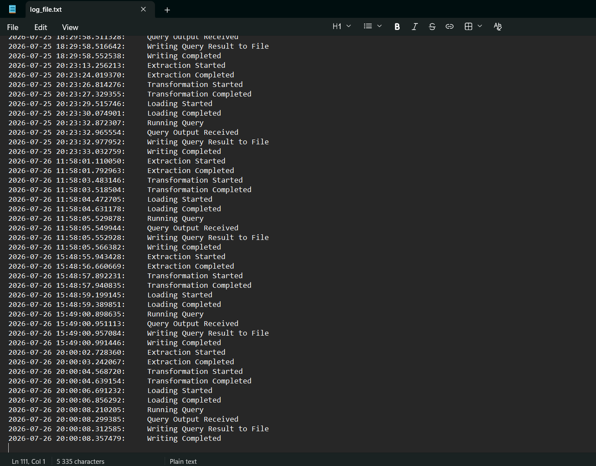

# Flight Tracking Data Pipeline

## Overview

This project is an end-to-end batch ETL pipeline that retrieves live aircraft tracking data around a specific location (Johannesburg in this case) from the Airplanes Live REST API, enriches each record by calculating the aircraft's distance from the set location using the Haversine formula, stores the processed data in a normalized SQLite database, and automatically generates daily analytical CSV reports through Apache Airflow orchestration.

## Project Objective

The goal of this project was to design an end-to-end ETL pipeline that demonstrates industry-standard data engineering practices including automated workflow orchestration, relational data modeling, error handling, and analytical reporting using live aircraft data.

---

## Technology Stack

| Technology | Purpose |
|------------|---------|
| Python | Core programming language used to develop the ETL pipeline |
| Apache Airflow | Workflow orchestration, scheduling, and task dependency management |
| Requests | REST API communication for retrieving live aircraft data |
| Pandas | Data extraction, cleaning, transformation, and CSV processing |
| NumPy | Vectorized geospatial distance calculations using the Haversine formula |
| SQLite | Relational database used for data storage and normalization |

---
## Key Design Decisions

| Decision | Rationale |
|----------|-----------|
| Apache Airflow | Selected to automate pipeline scheduling, task orchestration, retries, and dependency management. |
| SQLite | Chosen as a lightweight relational database suitable for a self-contained portfolio project without requiring a database server. |
| Normalized Database Schema | Separated aircraft, model, and flight data into related tables to reduce redundancy and improve data integrity. |
| Haversine Formula | Used to accurately calculate the distance between each aircraft and a fixed reference point (Johannesburg). |
| Batch Processing | Implemented a scheduled batch ETL workflow to simulate a common production data engineering pattern. |
| CSV Report Output | Generated analytical reports as CSV files to provide a portable and easily consumable output format. |

---


## Project Architecture


See:

```text
docs/architecture.md
```

---

## Workflow

See:

```text
docs/workflow.md
```

---

## Database Design

See:

```text
docs/database_design.md
```

---

## Workflow Orchestration

See:

```text
docs/orchestration.md
```
---

## Screenshots

### Airflow DAG


### Successful DAG Run



### Database Tables



For Other Tables See:

```text
docs/screenshots/database_tables.png
docs/screenshots/database_aircraft.png
docs/screenshots/database_model.png
```

### Query Results



### Log file



---

## Features

- ETL Pipeline
- Apache Airflow
- REST API Integration
- Data Cleaning
- Geospatial Processing
- Relational Database Design
- Database Normalization
- SQL Analytics
- Logging
- Error Handling
- Automated Reporting

---

## Repository Structure

```text
flight-tracking-data-pipeline/
│
├── dags/
│   └── flights_tracking.py
│
├── database/
│   └── flights_tracking.db
│
├── docs/
│   ├── architecture.md
│   ├── database_design.md
│   ├── orchestration.md
│   ├── workflow.md
│   └── screenshots/
│
├── logs/
│   └── log_file.txt
│
├── queryoutput/
│   └── results.csv
│
├── .gitignore
├── README.md
└── requirements.txt
```

---
## Getting Started

### Clone the repository

```bash
git clone https://github.com/ttmagweba/flight-tracking-data-pipeline.git
cd flight-tracking-data-pipeline
```

### Install dependencies

```bash
pip install -r requirements.txt
```

### Setup

Before running the pipeline, create a working directory that will store source data, transformed data, logs, results, and the SQLite database.

Example structure:

```text
Project/
│
├── source_data.csv
├── transformed_data.csv
├── results.csv
├── log_file.txt
└── flights_tracking.db
```

The file paths used in the Python script should be updated to match the location of your project directory.

For example:

```python
log_file = '/path/to/project/log_file.txt'
```

Update all file paths in the script to match your local environment before execution.

Copy DAG to respective airflow dags folder.

### Start Apache Airflow

```bash
airflow standalone
```

### Trigger the DAG

From the Airflow UI, trigger the `Flights_Tracking` DAG.

---

## Future Enhancements

- PostgreSQL Migration
- Docker Containerization
- Cloud Deployment
- Data Quality Validation
- Dashboard Visualizations
- CI/CD Implementation
- Data Warehouse Integration

---

## Author

Thabani Magweba
